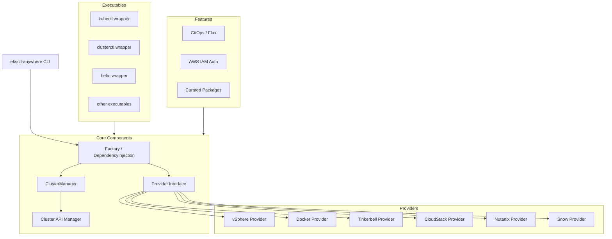
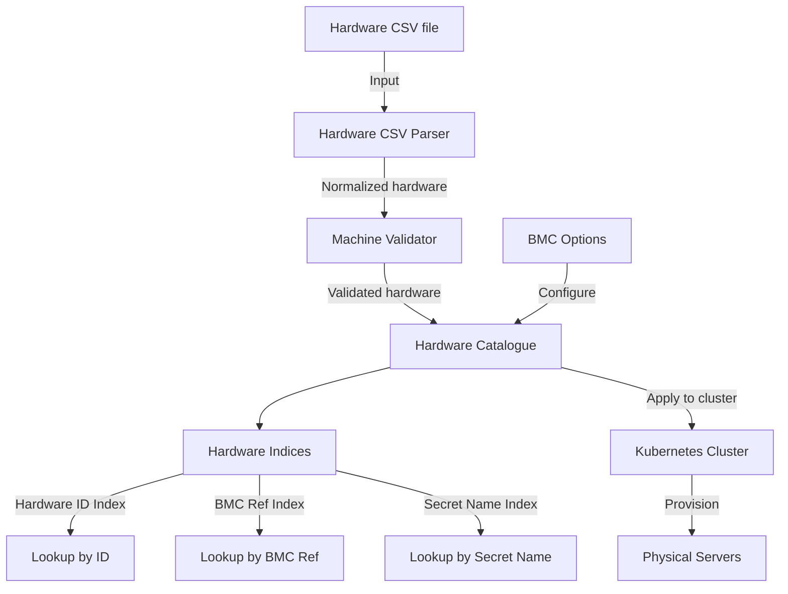
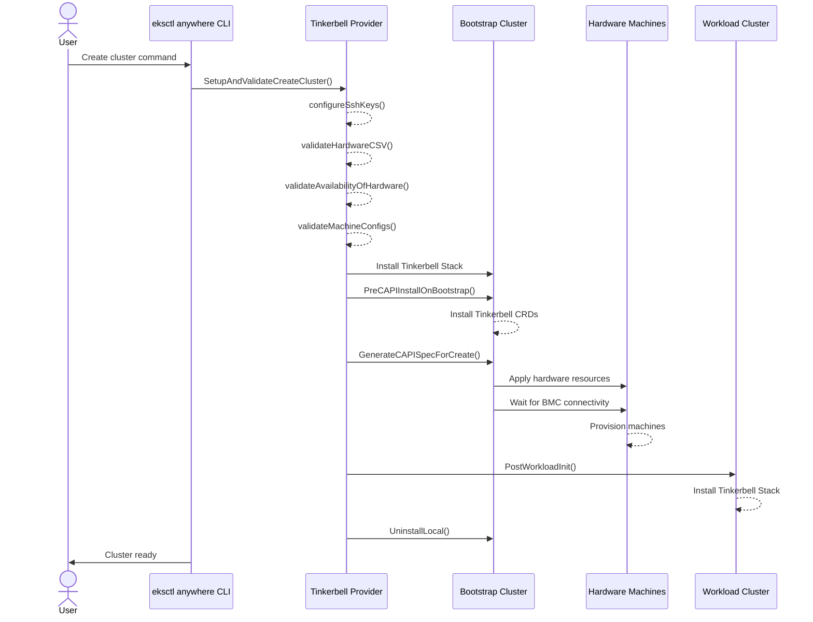

# Terraform Provider for Cluster API (CAPI)

This repository contains a [Terraform](https://www.terraform.io) provider for managing Cluster API resources using clusterctl. The CAPI management workflow is modeled after the [EKS Anywhere](https://github.com/aws/eks-anywhere) provisioning pattern.

## Features

- **Full CAPI Management Workflow**: Automated bootstrap cluster creation, CAPI initialization, workload cluster provisioning, and management pivot
- **clusterctl Integration**: Uses the official clusterctl client library for init, template generation, move, describe, and kubeconfig operations
- **Bootstrap Cluster Lifecycle**: Automatically creates and manages kind-based bootstrap clusters when no management cluster is provided
- **Self-Managed Clusters**: Support for pivoting CAPI management from bootstrap to workload cluster (mirrors EKS Anywhere's `moveClusterManagementTask`)
- **Flexible Configuration**: Support for multiple infrastructure providers (Docker, AWS, Azure, etc.)
- **Error Recovery**: Automatic bootstrap cluster cleanup on failure at any stage

## Architecture

### Design: EKS Anywhere CAPI Management Pattern

This provider implements the CAPI management workflow inspired by EKS Anywhere's `pkg/workflows/management/` package. The key insight from EKS Anywhere is the **bootstrap-pivot pattern**: a temporary bootstrap cluster is used to run CAPI controllers that provision the actual workload cluster, and management can optionally be pivoted to the workload cluster to make it self-managed.

#### Workflow Sequence (mirrors EKS Anywhere's `create.go`)

```
┌──────────────────────────────────────────────────────────────────┐
│                    Terraform Apply (Create)                       │
├──────────────────────────────────────────────────────────────────┤
│                                                                  │
│  1. createBootstrapClusterTask                                   │
│     └─ kind create cluster (temporary bootstrap)                 │
│                                                                  │
│  2. installCAPIComponentsTask                                    │
│     └─ clusterctl init (install CAPI + infra providers)          │
│                                                                  │
│  3. createWorkloadClusterTask                                    │
│     ├─ clusterctl generate cluster (template YAML)               │
│     └─ kubectl apply (create cluster resources)                  │
│                                                                  │
│  4. waitForClusterReady                                          │
│     └─ kubectl wait for Cluster Ready condition                  │
│                                                                  │
│  5. getWorkloadKubeconfig                                        │
│     └─ clusterctl get kubeconfig                                 │
│                                                                  │
│  6. moveClusterManagementTask (if self_managed=true)             │
│     ├─ clusterctl init on workload cluster                       │
│     └─ clusterctl move (bootstrap → workload)                    │
│                                                                  │
│  7. deleteBootstrapCluster (cleanup)                             │
│     └─ kind delete cluster                                       │
│                                                                  │
└──────────────────────────────────────────────────────────────────┘
```

#### Component Architecture

```
internal/
├── capi/                           # CAPI management components
│   ├── interfaces.go               # Core interfaces (Bootstrapper, Installer, Mover, etc.)
│   ├── types.go                    # Shared types (Cluster, options structs)
│   ├── errors.go                   # Typed errors with context
│   ├── manager.go                  # Orchestrator (mirrors EKS Anywhere's Create workflow)
│   ├── bootstrap.go                # kind-based bootstrap cluster lifecycle
│   ├── installer.go                # clusterctl init wrapper
│   ├── template.go                 # clusterctl generate cluster wrapper
│   ├── applier.go                  # kubectl apply/delete wrapper
│   ├── mover.go                    # clusterctl move wrapper (mirrors MoveCAPI)
│   ├── waiter.go                   # Cluster readiness waiter (kubectl wait)
│   ├── info.go                     # clusterctl get kubeconfig + describe cluster
│   └── docker/
│       └── provider.go             # Docker infra provider defaults
└── provider/
    ├── provider.go                 # Terraform provider configuration
    └── cluster_resource.go         # capi_cluster resource (uses capi.Manager)
```

#### Key Interfaces (from `internal/capi/interfaces.go`)

| Interface | EKS Anywhere Equivalent | Description |
|-----------|------------------------|-------------|
| `Bootstrapper` | `interfaces.Bootstrapper` | Creates/deletes kind bootstrap clusters |
| `Installer` | `CAPIClient.InitInfrastructure` | Installs CAPI providers via clusterctl init |
| `TemplateGenerator` | `clusterctl.GetClusterTemplate` | Generates cluster YAML templates |
| `Applier` | `ClusterClient.ApplyKubeSpecFromBytes` | Applies/deletes Kubernetes manifests |
| `Mover` | `ClusterManager.MoveCAPI` | Moves CAPI resources between clusters |
| `Waiter` | `ClusterManager.waitForCAPI` | Waits for cluster readiness conditions |
| `KubeconfigRetriever` | `CAPIClient.GetWorkloadKubeconfig` | Retrieves workload cluster kubeconfigs |
| `ClusterDescriber` | `clusterctl.DescribeCluster` | Describes cluster status |

All interfaces are injectable via functional options on `Manager`, enabling full test mocking.

#### EKS Anywhere Mapping

| EKS Anywhere Task | This Provider |
|---|---|
| `createBootStrapClusterTask` | `KindBootstrapper.Create()` |
| `installCAPIComponentsTask` | `ClusterctlInstaller.Init()` |
| `createWorkloadClusterTask` | `ClusterctlTemplateGenerator.Generate()` + `DynamicApplier.Apply()` |
| `moveClusterManagementTask` | `ClusterctlMover.Move()` |
| `deleteBootstrapClusterTask` | `KindBootstrapper.Delete()` |

## Requirements

- [Terraform](https://developer.hashicorp.com/terraform/downloads) >= 1.0
- [Go](https://golang.org/doc/install) >= 1.24
- [Docker](https://www.docker.com/) (for Docker infrastructure provider)
- [kind](https://kind.sigs.k8s.io/) (for bootstrap cluster creation)
- [kubectl](https://kubernetes.io/docs/tasks/tools/) (for manifest operations)
- [clusterctl](https://cluster-api.sigs.k8s.io/user/quick-start.html) compatible environment

## Building The Provider

1. Clone the repository
1. Enter the repository directory
1. Build the provider using the Go `install` command:

```shell
go install
```

## Adding Dependencies

This provider uses [Go modules](https://github.com/golang/go/wiki/Modules).
Please see the Go documentation for the most up to date information about using Go modules.

To add a new dependency `github.com/author/dependency` to your Terraform provider:

```shell
go get github.com/author/dependency
go mod tidy
```

Then commit the changes to `go.mod` and `go.sum`.

## Using the provider

The provider exposes a `capi_cluster` resource for managing Cluster API clusters.

### Example: Basic Docker Cluster (with automatic bootstrap)

```hcl
terraform {
  required_providers {
    capi = {
      source = "hashicorp-oss/capi"
    }
  }
}

provider "capi" {}

# Creates a bootstrap kind cluster automatically, installs CAPI,
# provisions the workload cluster, and waits for readiness.
resource "capi_cluster" "my_cluster" {
  name                        = "my-cluster"
  infrastructure_provider     = "docker"
  bootstrap_provider          = "kubeadm"
  control_plane_provider      = "kubeadm"
  kubernetes_version          = "v1.31.0"
  control_plane_machine_count = 1
  worker_machine_count        = 2
  wait_for_ready              = true
  target_namespace            = "default"
}
```

### Example: Self-Managed Cluster (with management pivot)

```hcl
# Creates a self-managed cluster by:
# 1. Creating a bootstrap kind cluster
# 2. Installing CAPI on bootstrap
# 3. Provisioning the workload cluster
# 4. Installing CAPI on workload cluster
# 5. Moving CAPI management from bootstrap to workload (clusterctl move)
# 6. Deleting the bootstrap cluster
resource "capi_cluster" "self_managed" {
  name                        = "self-managed-cluster"
  infrastructure_provider     = "docker"
  bootstrap_provider          = "kubeadm"
  control_plane_provider      = "kubeadm"
  kubernetes_version          = "v1.31.0"
  control_plane_machine_count = 1
  worker_machine_count        = 1
  self_managed                = true
  wait_for_ready              = true
}
```

### Example: Using an Existing Management Cluster

```hcl
# Skip bootstrap creation - use an existing management cluster
resource "capi_cluster" "workload" {
  name                        = "workload-cluster"
  management_kubeconfig       = "~/.kube/management-cluster.kubeconfig"
  infrastructure_provider     = "docker"
  kubernetes_version          = "v1.31.0"
  control_plane_machine_count = 3
  worker_machine_count        = 5
  skip_init                   = true  # CAPI already installed
  wait_for_ready              = true
}
```

### Available Resources

- **capi_cluster**: Manages a Cluster API cluster using the full CAPI management workflow

### Resource Attributes

| Attribute | Type | Required | Description |
|-----------|------|----------|-------------|
| `name` | string | **yes** | Cluster name (forces replacement on change) |
| `infrastructure_provider` | string | **yes** | Infrastructure provider (e.g., `docker`, `aws`, `azure`) |
| `management_kubeconfig` | string | no | Path to existing management cluster kubeconfig. If omitted, a kind bootstrap cluster is created automatically |
| `skip_init` | bool | no | Skip `clusterctl init` (default: `false`) |
| `wait_for_ready` | bool | no | Wait for cluster readiness (default: `true`) |
| `self_managed` | bool | no | Pivot CAPI management to workload cluster (default: `false`) |
| `bootstrap_provider` | string | no | Bootstrap provider (e.g., `kubeadm`) |
| `control_plane_provider` | string | no | Control plane provider (e.g., `kubeadm`) |
| `core_provider` | string | no | Core provider version (e.g., `cluster-api:v1.7.0`) |
| `target_namespace` | string | no | Target namespace (default: `default`) |
| `kubernetes_version` | string | no | Kubernetes version for the workload cluster |
| `control_plane_machine_count` | number | no | Number of control plane machines |
| `worker_machine_count` | number | no | Number of worker machines |
| `flavor` | string | no | Cluster template flavor |
| `kubeconfig_path` | string | no | Path to write the workload cluster kubeconfig |

#### Computed Attributes

| Attribute | Description |
|-----------|-------------|
| `id` | Cluster identifier |
| `kubeconfig` | Workload cluster kubeconfig content (sensitive) |
| `cluster_description` | Cluster status from `clusterctl describe` |
| `endpoint` | API server endpoint |
| `cluster_ca_certificate` | Cluster CA certificate (sensitive) |
| `bootstrap_cluster_name` | Name of the bootstrap cluster (if one was created) |

For detailed documentation, see the [docs](./docs) directory.

## Developing the Provider

If you wish to work on the provider, you'll first need [Go](http://www.golang.org) installed on your machine (see [Requirements](#requirements) above).

To compile the provider, run `go install`. This will build the provider and put the provider binary in the `$GOPATH/bin` directory.

To generate or update documentation, run `make generate`.

### Running Tests

Unit tests (no external dependencies):

```shell
go test ./internal/capi/... -v
```

Acceptance tests (require Docker, kind, kubectl):

```shell
make testacc
```

*Note:* Acceptance tests create real resources (Docker containers for kind clusters).

### Implementing New Management Components

To add a new CAPI management operation, follow this pattern:

1. **Define the interface** in `internal/capi/interfaces.go`
2. **Implement the concrete type** in a new file under `internal/capi/`
3. **Add a functional option** in `internal/capi/manager.go` (e.g., `WithNewComponent()`)
4. **Create a mock** in `internal/capi/mock_test.go`
5. **Wire it into the Manager workflow** in `manager.go`'s `CreateCluster` or `DeleteCluster`
6. **Expose it in the Terraform resource** in `internal/provider/cluster_resource.go`
7. **Add tests** at both the `capi` package level (unit) and `provider` level (acceptance)

### Adding a New Infrastructure Provider

1. Create a new package under `internal/capi/<provider>/` (e.g., `internal/capi/aws/`)
2. Define default `CreateClusterOptions` similar to `internal/capi/docker/provider.go`
3. Add any provider-specific pre/post hooks to the `Manager` workflow
4. Add integration tests

## Design - EKS Anywhere



## Tinkerbell Provider

### Hardware Management

The Tinkerbell provider manages hardware resources through a catalogue system, which tracks available and allocated hardware for cluster components.



### Cluster Lifecycle Management


